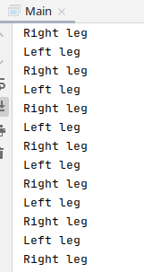

# ROBOT
## Постановка задачи
Реализуйте класс робота, имеющего 2 ноги. Каждая нога осуществляет работу(шаг) в отдельном потоке.
Необходимо выполнить одно условие: шаги выполняются поочередно разными ногами. При этом неважно
с какой ноги начинает ходить робот.

## Результаты работы приложения
Результат: 
Поочередное выполнение обеспечивается методами wait, который переводит поток в состояние ожидания 
до тех пор, пока другой поток не вызовет метод notify().
